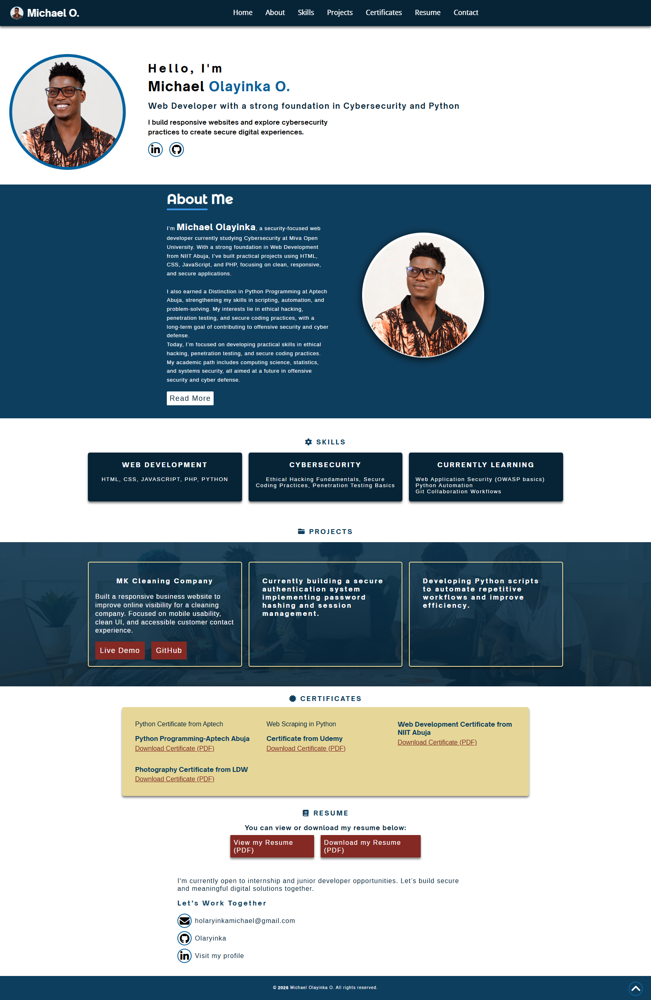

# 🌐 My Portfolio

# Hi, I'm Michael Olayinka 👋

Security-focused Web Developer passionate about
building secure and responsive web applications.

## 🔧 Tech Stack
HTML • CSS • JavaScript • PHP • Python

## 🌱 Currently Learning
- Web Application Security (OWASP)
- Python Automation
- Secure Authentication Systems

## 📫 Contact
Portfolio: https://olayinka-portfolio-rouge.vercel.app
Email: holaryinkamichael@gmail.com

🔗 **Live Demo:** [View Portfolio](https://olayinka-portfolio-rouge.vercel.app/)

---

## ✨ Features
- Responsive design (works on desktop, tablet, and mobile)
- Smooth navigation with toggle menu
- Projects section with descriptions and links
- About Me & Contact section
- Built with clean and modern UI principles

---

## 🛠️ Tech Stack
- **HTML5**
- **CSS3** (Flexbox & Grid)
- **JavaScript (ES6+)**

## 📸 Screenshot

### Homepage

